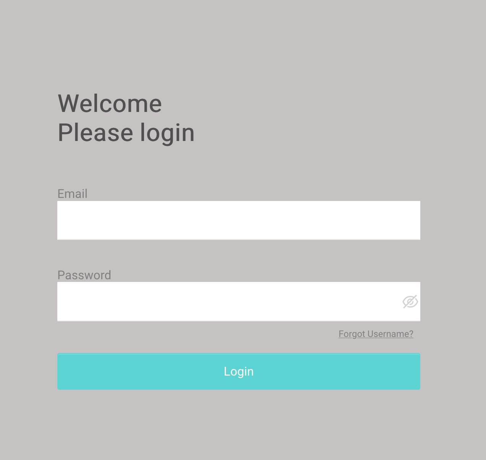
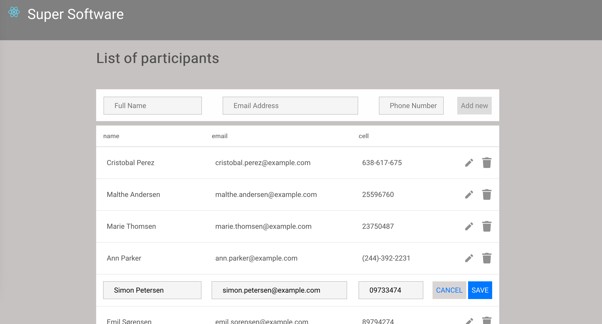

# Getting Started with Create React App

This project was bootstrapped with [Create React App](https://github.com/facebook/create-react-app).

## Installation

```
git clone ...
cd ...
yarn install
yarn start
```
localhost:3000/





## Description

in package.json
```
    lodash
    react
    react-hook-form
    react-icons
    react-router-dom
    typescript
```


```
.
├── App.css
├── App.tsx                           // Main page - routing      
├── components
│   ├── Layout
│   │   └── NavBar.tsx
│   ├── Login.tsx                     // 1rst page Login(any email and password)
│   └── Table                         // components of the 2nd page Participants.tsx
│       ├── Add
│       │    └── Adding.tsx
│       ├── BodyTable.tsx
│       ├── Edit
│       │    └── Editing.tsx
│       ├── Participants.css
│       └── Participants.tsx          // 2nd page
├── index.css
├── index.tsx
├── logo.svg
└── utils                             // data, interfaces and some functions
    ├── Data.ts
    ├── interfaces.ts
    └── utils.ts
```

In the project directory, you can run:

### `yarn start`

Runs the app in the development mode.\
Open [http://localhost:3000](http://localhost:3000) to view it in the browser.

The page will reload if you make edits.\
You will also see any lint errors in the console.


### To improve
___

no asked in the test, but need to improve
- responsive mobile
- alert message
- css transition effect on delete/add